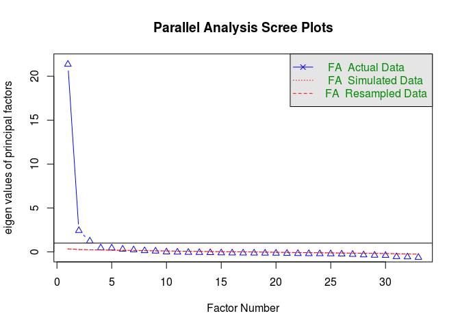
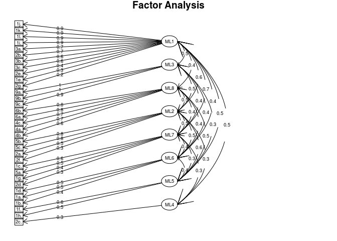

FactorAnalysis
================

``` r
## Installing packages if not available
list.of.packages <- c("psych", "dplyr","readxl","stringr","GPArotation")
new.packages <- list.of.packages[!(list.of.packages %in% installed.packages()[,"Package"])]
if(length(new.packages)) install.packages(new.packages)
```

``` r
## Loading required packages into the environment
library(psych)
library(dplyr)
```

    ## 
    ## Attaching package: 'dplyr'

    ## The following objects are masked from 'package:stats':
    ## 
    ##     filter, lag

    ## The following objects are masked from 'package:base':
    ## 
    ##     intersect, setdiff, setequal, union

``` r
library(readxl)
library(stringr)
library(GPArotation)
options(warn=-1)
```

``` r
## loading functions to process data
source("support_functions.R")
```

``` r
file <- "../robinhood0719/data/raw/nycschoolsurvey_data/2018-public-data-file_parent.xlsx"
sheet <- "Parent # of Resp"
```

``` r
## loading ELA & Math performance data
perf <- read.csv("../robinhood0719/data/interim/perf_data_2006_2019.csv")
## loading survey data
parent_survey_data <- read_survey_data(file,sheet)
```

``` r
## filtering 
parent_responses <- parent_survey_data[[1]]
parent_responses <- parent_responses[parent_responses$dbn %in% perf$DBN,]
```

``` r
## Defining numerical ratings for responses
used_ratings <- c("Strongly agree","Agree","Disagree","Strongly disagree","Very satisfied","Satisfied","Dissatisfied","Very dissatisfied","Don\'t know","Very Dissatisfied","Very unlikely","Somewhat unlikely","Somewhat likely", "Very likely","Never","Rarely","Sometimes","Often")
rating_values <- c(5,4,2,1,5,4,2,1,0,1,1,2,4,5,1,2,4,5)

## Summarizing rating scores for each question
psr <- get_summarized_scores(parent_responses,parent_survey_data[[2]],used_ratings,rating_values)
psr$year <- 2018

## filtering out questions with >5% missingness
## pre-k/3-K, and high-school specific questions get filtered out
## Also Q7 for which responses can not be coded numerically given its subjective nature
psr <- psr[,apply(psr[,(1:(ncol(psr)-2))],2,FUN=function(x) sum(is.na(x)))*100/nrow(psr) < 5]
```

``` r
## parallel plot to determine approximate number of factors
fa.parallel(psr[,1:(ncol(psr)-2)],fa="fa",fm="mle")
```



    ## Parallel analysis suggests that the number of factors =  7  and the number of components =  NA

``` r
## fitting factor model with 8 factors after couple of iterations
pfm <- fa(psr[,1:(ncol(psr)-2)],fm="mle",rotate='oblimin',nfactors=8)
```

``` r
## factor loadings/weights
print(pfm$loadings,cutoff=0)
```

    ## 
    ## Loadings:
    ##     ML1    ML3    ML8    ML2    ML7    ML6    ML5    ML4   
    ## 1a.  0.167  0.117  0.149  0.089  0.272  0.455  0.042 -0.014
    ## 1b.  0.104  0.119  0.343 -0.088  0.103  0.424  0.075  0.135
    ## 1c.  0.097  0.092  0.061 -0.011  0.621  0.108  0.239  0.016
    ## 1d.  0.107  0.083  0.072  0.264  0.026  0.544  0.176 -0.048
    ## 1e.  0.340  0.105  0.074  0.121  0.251  0.213  0.149 -0.011
    ## 1f.  0.074  0.054  0.080  0.277  0.021  0.169  0.552 -0.021
    ## 1g.  0.282  0.089  0.058  0.118  0.370  0.203  0.158  0.003
    ## 1h.  0.120  0.038  0.206  0.110  0.237 -0.035  0.534  0.019
    ## 1i.  0.886  0.015 -0.001 -0.075  0.100  0.008  0.135 -0.038
    ## 1j.  0.943  0.027  0.038  0.032  0.010 -0.007  0.044 -0.066
    ## 1k.  0.943  0.025  0.057  0.067  0.000 -0.033  0.027 -0.077
    ## 1l.  0.926  0.039 -0.026  0.006  0.024  0.084 -0.004 -0.033
    ## 2a. -0.036  0.054  0.071  0.506  0.001  0.181  0.255  0.239
    ## 2b.  0.666  0.060 -0.038  0.090  0.051  0.129 -0.037  0.221
    ## 2c.  0.239  0.112 -0.121  0.223  0.224  0.064  0.045  0.293
    ## 2d.  0.228  0.130 -0.060  0.221  0.304  0.219  0.050  0.162
    ## 2e.  0.425  0.053  0.084  0.259 -0.129  0.062  0.223  0.130
    ## 2f.  0.115  0.082  0.089  0.264  0.104  0.150  0.197  0.035
    ## 2g.  0.245  0.069  0.088  0.146  0.129  0.045  0.237  0.176
    ## 3a.  0.732  0.035 -0.097  0.103  0.082  0.110 -0.139  0.219
    ## 3b.  0.623  0.049  0.137  0.066  0.080 -0.089  0.037  0.330
    ## 3c.  0.588  0.062  0.183  0.015  0.033 -0.017  0.050  0.375
    ## 4a. -0.049  0.017  0.671  0.043  0.060 -0.029  0.079  0.245
    ## 4b. -0.076  0.001  0.574  0.071  0.062  0.391 -0.020 -0.011
    ## 4c.  0.104  0.060  0.678  0.157 -0.107  0.121  0.007 -0.116
    ## 5a.  0.157  0.082  0.125  0.380  0.529 -0.024 -0.107  0.018
    ## 5b.  0.063  0.048  0.005  0.840  0.081 -0.011  0.018 -0.025
    ## 5c. -0.001  0.050  0.123  0.774 -0.012  0.062  0.089 -0.001
    ## 6a.  0.008 -0.018  0.758  0.008  0.185  0.049 -0.040  0.042
    ## 6b.  0.053  0.001  0.809  0.035 -0.051 -0.069  0.146 -0.063
    ## 9a. -0.026  1.001 -0.028  0.006 -0.031 -0.009 -0.024 -0.036
    ## 9b. -0.036  0.998  0.053 -0.020 -0.019 -0.034  0.000  0.016
    ## 9c.  0.021  0.930 -0.072 -0.027  0.018  0.003 -0.009 -0.012
    ## 
    ##                  ML1   ML3   ML8   ML2   ML7   ML6   ML5   ML4
    ## SS loadings    5.824 3.006 2.831 2.233 1.286 1.150 1.042 0.681
    ## Proportion Var 0.176 0.091 0.086 0.068 0.039 0.035 0.032 0.021
    ## Cumulative Var 0.176 0.268 0.353 0.421 0.460 0.495 0.526 0.547

``` r
## diagram displaying factor-question associations
fa.diagram(pfm,cut=0.245)
```


